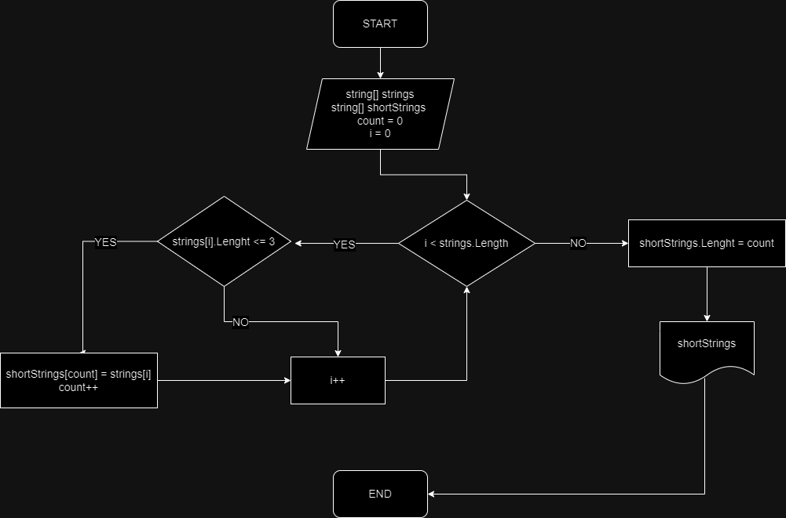

# Итоговая работа

Это программа которая из имеющегосяя массива строк создае новый массив со строками меньше или равными 3 символам.

## Описание алгоритма аботы программы:

1. Создаем 2 массива строк, первый массив несет в себе все строки, а во второй массив строк будут записываться необходимые нам строки из первого массива;
2. Вводим переменную счетчик count;
3. При помощи функции __*for*__  и функции __*if*__ переберем каждое значение в первом массиве и запишем необходимые нам данные во второй массив;
4. Использовав метод __*Array.Resize*__ изменим размер второго массива до значение счетчика __*count*__;
5. Вывод массива

## Блок схем алгоритма 
 
 
